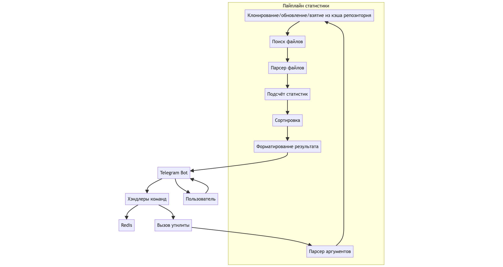

# Git-Stat

### Описание
Утилита для подсчета статистик git-репозитория,
включающая в себя сортировку и фильтрацию полученных
результатов. Для каждого редактора репозитория будут
поддерживаться следующие статистики:
- `lines` -- количество измененных линий;
- `commits` -- количество сделанных коммитов;
- `files` -- количество измененных файлов;
- ... -- возможно придумаем в ходе реализации еще 
что-то.

Планируется сделать интерфейс для работы с утилитой
через телеграм бота.

##### Что будет видеть пользователь?
В телеграм боте пользователю будут доступны следующие 
функции (сделаем отдельные кнопки для каждой из 
команд и какие-то сценарии для удобной записи всех
необходимых аргументов; пока запишу именно командами,
потому что не знаю, как иначе унифицировать это все):
- `/add_repo <link>` -- добавить репозиторий по ссылке
`link` в свой список (скорее всего, будет 
использоваться Redis);
- `/list_repo` -- вывести список всех добавленных
репозиториев;
- `/remove_repo <link>` -- удалить репозиторий из
списка по ссылке;
- `/get_stats <link> <options...>` -- получить
статистики репозитория по ссылке `link`
(предварительно нужно добавить репозиторий в свой
список). Будут поддерживаться следующие `options`:
    - `<revision>` -- ревизия репозитория, для которой
        будут посчитаны статистики.
    - `<order-by>` -- тип сортировки результатов. Должен
        принимать одно из следующих значений:
      - `lines` -- сортировка по количеству измененных 
        линий (по умолчанию);
      - `commits` -- сортировка по количеству сделанных
        коммитов;
      - `files` -- сортировка по количеству измененных
        файлов.
    - `<format>` -- способ вывода результатов. Должен 
        принимать одно из следующих значений:
      - `tabular` -- вывод в текстовом формате, 
        колонки разделяются табуляциями (по умолчанию);
      - `csv` -- csv-файл;
      - `json` -- json-файл.
    - `<extensions...>` -- список расширений файлов, 
        которые будут участвовать в расчете статистик.
    - `<globs_to_exclude...>` -- список glob'ов для 
        исключения из расчета статистик.
    - `<globs_to_restrict...>` -- список glob'ов, 
        которым должен удовлетворять каждый файл,
        участвующий в расчетах статистик.

### Задачи
Все задачи, связанные с написанием утилиты для
подсчета статистик, буду делать я -- Комаров Александр.
Задачи на написание телеграм бота будет выполнять
Лукоянов Алексей.
- Написать парсинг полученных аргументов в какой-то 
класс конфига;
- Написать класс, который скачивает репозиторий или
обновляет его (репозитории и их статистики будут 
кэшироваться, так как операции как клонирования, так 
и подсчета статистик являются, вообще говоря, 
дорогими; скорее всего, будет использоваться LRU кэш);
- Написать класс, находящий все файлы в репозитории,
соответствующие полученным аргументам;
- Написать класс, который парсит файл в удобный для
подсчета статистик формат;
- Написать класс для подсчета статистик; 
- Написать класс для сортировки статистик;
- Написать класс для вывода статистик в требуемом
формате
- Написать удобный для использования интерфейс в
телеграм боте;
- Написать хэндлеры для обработки всех команд.

### Ожидаемая схема работы
